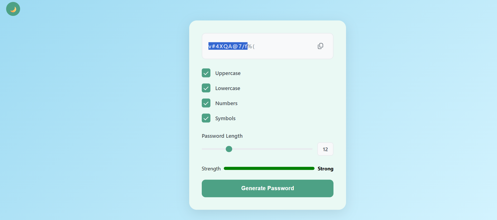
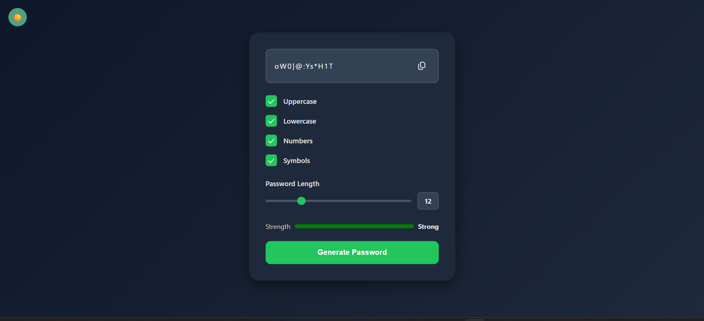

# 🔐 Password Generator

A modern and responsive Password Generator built using HTML, CSS, and JavaScript.
It helps users generate secure passwords with customizable options and an easy-to-use interface.

---

## ✨ Features

- 🔑 Generate strong random passwords
- 🔠 Include Uppercase Letters
- 🔡 Include Lowercase Letters
- 🔢 Include Numbers
- 🔣 Include Symbols
- 📏 Adjustable Password Length
- 📋 One-click Copy to Clipboard
- 💪 Password Strength Indicator
- 🌙 Dark Mode
- 📱 Fully Responsive Design

---

## 🛠️ Built With

- HTML5
- CSS3
- JavaScript (ES6)

---

## 🚀 How to Use

1. Select the password options.
2. Choose the password length using the slider.
3. Click Generate Password.
4. Copy the generated password using the copy button.

---

## 📸 Screenshots

### ☀️ Light Mode

### 🌙 Dark Mode

## 📂 Project structure 
--
Password-Generator/
│── index.html
│── style.css
│── script.js
│── README.md
│── light-mode.png
│── dark-mode.png
---

## 🌐 Live Demo

https://aasthaverma00.github.io/Password-Generator-/

---

## 👩‍💻 Author

Aastha verma 

---

⭐ If you like this project, don't forget to star the repository!